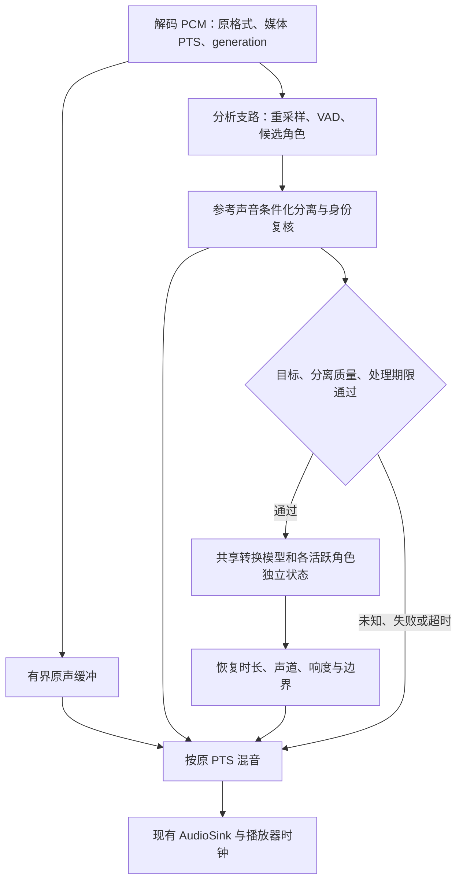

# WebHTV 本机离线实时角色声音替换：研究与适配方案

> 研究日期：2026-09-28，Asia/Shanghai。代码基线：`main` / `3f3031748882713455a47ded88c58ce6956fcb1c`。
> 范围：研究、设计及实际代码审阅；未实施功能，未下载／运行神经模型，未做 Android 性能实测。
> 部署约束：声音采集、建档、识别、分离、转换、缓存均在 Android 手机／电视本机完成，不依赖云端或局域网 GPU。
> 最新体积约束：优先几十 MB 的手机方案；本次轻量补充基线为 `main` / `f69db83746312b0ad98ea4c38eb907bb024a6fd0`。原有任意 A 碎片采样要求继续有效，未改成仅预置声线。
> 按用户要求，本文件是唯一持久方案，保存在 `plans`；不另建重复 `docs` 文档，不改既有上游合并计划。

## 1. 结论与推荐

**建议采用“本机声音建档 + 作品内角色识别 + 目标声音分离 + 流式音色转换 + 按原时间轴混回”的架构，先验证 ARM64 设备上的完整链路，再接入 Exo。**

**按新增的“几十 MB”约束，模型首选调整为验证 OpenVoice V2 独立音色转换器的导出与量化，MeanVC2 降为质量对照。** OpenVoice 已发布转换器为 131.3 MB，FP16 约 66 MB／INT8 约 33 MB 只是理想权重体积估算，尚未得到经验证的对应产物；它也不是已验证的因果流式 Android 后端。已核实的 LLVC 单个权重确实只有 39.5 MB，但对应固定目标音色，不支持采几段任意新 A 就直接使用。第 4.5 节给出完整核算，不能把这些数字当作全功能安装包或运行内存。

当前证据支持启动可行性原型，但不足以承诺“任意 Android 电视、任意影视混音、多人重叠、接近零延迟”同时成立。主要风险是从配乐、混响和重叠对白中准确取出指定角色，以及普通电视盒子持续运行整条链路的算力；单个变声模型的演示没有覆盖这些问题。

| 部分 | 推荐 | 当前结论 |
|---|---|---|
| A 的目标音色转换 | **OpenVoice V2 独立转换器量化验证**；MeanVC2 保留质量对照 | 支持多参考建档和直接音频转换；几十 MB 产物、分块音质和 Android 性能均待验证 |
| B/C/D 的身份识别 | **CAM++／ECAPA 类声纹 + VAD + 开放集拒识**，评估 WeSpeaker／sherpa-onnx 移动部署路径 | 无须从零训练识别网络，但要用作品内样本标定 |
| 指定角色波形提取 | **参考声音条件化的流式 TSE**；SpeakerBeam、Look Once to Hear、WeSep 作模型与训练参考 | 尚未核实覆盖中文动漫混音和普通 Android 的现成完整交付件，是首要门槛 |
| 播放器 | **先 Exo PCM，有界异步处理和原 PTS；MPV 单独适配** | 有接入位置；现有 K 歌／音高功能不等于声音替换 |
| 点播体验 | 短暂准备、有限预读、画面和声音共同遵守原时间轴 | 可放宽首包延迟，不能解决长期吞吐不足 |
| 失败策略 | 不确定、超时、不支持的片段播放原声，组状态可见 | 同时统计替换覆盖率，防止“全部回退”被当作识别准确 |

这里的“最佳实践”指证据支持的架构、风险控制和验证路线；**模型组合的产品可用性仍是有条件结论**。论文指标和 README 不作为本项目验收结果。

相对直接集成桌面变声器，必须优化／修正六件事：分开 A 的合成条件与 B 的识别声纹；补上角色分离与背景混音；控制长视频内存；建档模型与播放模型分时加载；让替换服从播放器时钟；按设备与引擎声明支持能力。

## 2. 可测试的产品契约

### 2.1 用户流程

1. 播放参考音视频或麦克风录制，圈选多个不连续 A 片段，可试听、删除、补录；检查多人混说、音乐覆盖、削波和有效语音不足，形成声音档案。
2. 播放待观看作品，圈选 B 的多个片段，保存角色档案；C、D 分别建档。用户标注的是“这段是韩立”，模型不能仅凭名字知道谁在说话。
3. 建立 `A ← {B, C, D}`，明确表示“用 A 的声音替换 B/C/D”；其他组可为 `E ← {F, G}`，同时启用。
4. 播放前检查模型、音轨、引擎和设备能力，显示“准备中／已启用／部分片段原声／当前不可用”；正式播放自动识别和转换，保留原内容、媒体时间与其他声音。
5. 支持关组、优先级调整、补充样本和纠正误认；修改后旧缓存失效，不能继续播放旧声音。

“周星驰的声音”以实际参考为准：粤语本人、普通话配音、不同录音年代可分档。模仿音色不等于复制演员表演风格、口音、笑声和情绪；这些分别测试，不作为零样本模型的当然能力。

### 2.2 模式边界

| 模式 | 本机实现方向 | 限制 |
|---|---|---|
| App 内音视频采样／播放 | 本 App 解码 PCM | 首选，不经过扬声器重录 |
| 麦克风建档 | 独立录音入口、原声保存和质量提示 | 外放重录有房间混响、设备频响；质量通常较低 |
| 麦克风持续替换输出 | 独立低延迟模式、耳机优先、输入／输出路由和回声处理 | 若仅用于采样，不自动开启监听；持续变声有采集和识别延迟 |
| 其他 App 系统音频 | AudioPlaybackCapture 独立扩展 | API 29+、用户授权及来源 App 策略；本项目 minSdk 24，不能宣称任意 App 通用 [S34] |
| 点播本机预处理 | 提前分析、按片段缓存 | 弱设备补充模式，不等同于直播／麦克风实时处理 |

媒体和模型包可从本机文件／离线介质导入。首次下载是可选分发方式；运行、注册声音和推理不能要求外部服务或网络可用。

## 3. 研究方法与证据等级

已检索并阅读适用的论文全文、项目源码和测试入口、官方文档、issues／PR／维护者交流、技术博文和现场报告。先按部署约束比较，再深查 MeanVC2、原生实现与 Media3。搜索摘要和宣传延迟不单独作证据。

| 等级 | 含义 | 能证明什么 |
|---|---|---|
| A | 本地代码、固定提交源码、官方接口、模型文件元数据 | 接口／逻辑／依赖存在；不自动证明性能和音质 |
| B | 论文全文和实验 | 论文硬件、数据、块长与测量范围内的结果 |
| C | 相关项目部署说明、技术博文 | 方法可借鉴，适用域和移植成本仍需确认 |
| D | issue、讨论、现场报告 | 具体风险线索；复现条件不足时不外推指标 |

访问日期统一为 **2026-09-28**；固定源码版本见第 13 节，动态文档按访问日快照引用。源码存在、权重有元数据、权重已下载校验、Android 已测通是四种状态，本轮只覆盖前两种。

适用证据类别均有覆盖。本轮没有待合并的上游提交，不做无关 commit／revert 穷举；重点核查候选实现、关联 issues／PR 和当前依赖。pyannote community-1 模型卡返回 401，未据此判断完整权重许可。误命中的 arXiv `2110.10041` 是无关论文，已排除。搜索站点限流／验证页不作为有效证据。

## 4. 模型与路线比较

### 4.1 音色转换

以下均为来源报告，**不是 WebHTV Android 实测**。实时性需覆盖未来上下文、推理、建档／加载、设备缓冲、角色识别与分离。

| 候选 | 要求／报告结果 | 本需求价值与决策 |
|---|---|---|
| **OpenVoice V2 converter** [S44] [S45] | 官方权重 131.3 MB；内置参考编码器与波形解码器，多参考、直接音频转换 | **轻量预算下优先验证**。FP16／INT8 体积为待验证估算；点播分块、中文情绪、持续速度和量化音质未测 |
| **MAIN-VC** [S47] | 1.31M 参数，FP32 参数理论约 5.24 MB；论文明确不含 WaveRNN vocoder | 进一步小型化研究备选；不是已核实的 5 MB 完整换声包，主权重发布、中文和手机运行仍有缺口 |
| **Beatrice 2** [S48] | 官方开发目标最小配置 ≤30 MB、桌面单线程低负载；新声线需要训练 | 固定／已训练声线支线，不能代替任意 A 本机采样；具体最小产物和 Android ABI 未核实 |
| **MeanVC2** [S01] [S02] | 零样本、中英；单核 AMD EPYC 7542 首包 109.88 ms，ASR + VC + vocoder RTF 0.633；18M 为论文模型口径 | 质量与流式对照。完整 Q4_K 包 342 MB，不作为当前几十 MB 预算的默认模型 |
| **StreamVC** [S05] | Pixel 7 单核 XNNPACK；20 ms 块计算 10.8 ms；60 ms 架构延迟，合计 70.8 ms | 端侧可行性依据。所查官方演示无可直接采用的完整发布件；非官方实现明确无 checkpoint，且未实现论文的完整 streaming |
| **RT-VC** [S06] | Apple M3 CPU：15 ms 块 + 32 ms lookahead + 14.4 ms compute = 61.4 ms | 保留候选；英语实验，完整权重／训练代码发布需核定。M3 与 Pixel 7 不能直接比较速度提升比例 |
| **LLVC** [S07] [S43] | 16 kHz、any-to-one、CPU 低延迟；已发布单个权重 39,489,146 bytes | 固定 A 专用模型确实轻量；只作已有模型导入支线，不满足默认任意 A 碎片即用 |
| **RVC** [S08] | 检索增强；README 推荐至少约 10 分钟低噪目标数据，通常每个 A 训练 | 生态成熟，可导入已有模型；不作默认。桌面 ASIO 延迟不能移用到 Android |
| **Seed-VC** [S09] | 参考约 1–30 秒；tiny 25M；RTX 3060 Laptop 示例约 180 ms block、150 ms inference、430 ms latency | 音质／上下文／拼接参考；多组件／GPU 成本、GPLv3，2025-11-21 已归档。25M 不等于整链规模 |
| **StreamVoice** [S10] | 流式零样本，约 124 ms 报告来自 A100 条件 | 研究对照，不能作为本机预算 |
| **MeanVC** [S11] | MeanVC2 前代，流式 mean-flow | 对照质量、步数与延迟；优先评估后继，不维护两套默认后端 |
| **StreamVoiceAnon／Plus** [S12] | 多参考，`alpha=1` 可纯 VC；Plus 研究情绪保留 | 借鉴条件管理；当前 CUDA／Triton 依赖，Plus 权重需核定。匿名化噪声不适合精确模仿 A |
| **X-VC** [S13] | 中英、零样本、多组件 GLM-4-Voice tokenizer／ERes2Net／codec | 质量对照；缺少整链 Android 证据，暂缓 |
| ASR → 文本 → 克隆 TTS | 文本识别、标点韵律、重合成与对齐 | 适合重新配音／翻译；错字、语气和时长漂移不适合作“原台词原表演实时换音色”主路径 |
| w-okada 等桌面／服务器包装器 [S14] | 整合模型与音频 I/O | 借鉴参数／UI；有手机客户端不代表推理在手机本地 |

RT-VC 的 “source extractor” 是发声激励特征提取，**不是**从影视混音中取出韩立的 TSE。Zero-VC、Conan 等也已检索到，但未完成其权重、原生运行和影视适用性核查，不列入已验证推荐。

### 4.2 MeanVC2 质量对照的源码适配项

固定代码 [S02]：

- `runtime/run_rt.py::VCRunner` 加载 Fast-U2++、VC、Vocos、WavLM Large + ECAPA，并预计算目标音色 GTM KV。播放较轻不代表建档也轻。
- `self.CHUNK = 2560` 在 16 kHz 是 **160 ms**，`_vc_step` 使用 **`N = 2`**；模型文件名带 “40ms” 不代表整个 App 40 ms 出声，两步代码不能标为一步论文配置。
- fbank／ASR offset、余数帧、VC KV、噪声、vocoder overlap 都有状态。仅缩块、删除未来帧或每块重置会破坏上下文契约。
- `runtime/src/speaker.py::extract_embedding` 文档写 “L2-normalized”，实际末尾明确 **不做 L2 归一化**，保持训练时 raw embedding。以代码为准。
- A 的合成条件必须匹配该模型的 WavLM／ECAPA 权重、维度和尺度；B 的识别可用另一轻量网络，不能因为都叫“声纹”就互换。

issue #9 [S03] 的 Android 移植者报告 120 ms 模型 RTF < 0.7，但首出声 600–800 ms；缺少完整设备／测量范围，只作 D 级线索。issue #3 讨论 Fast-U2++ 与 WER，不能由此随意换内容编码器。issue #6 指向 `audio.cpp`，本轮继续审阅实际源码后才将其列为候选。

### 4.3 `audio.cpp` 原生实现的适配项

已核查提交 `77491a33c589c53ff18add050095cf35647c8213` [S04]：

| 实际实现 | 适配决定 |
|---|---|
| `assets.cpp` 加载 `vc/vocos/asr/speaker_wavlm/speaker_ecapa` | 本机建档确有组件，不是只接受电脑预提取向量的空壳 |
| `speaker_encoder.cpp` 为 24 层、1024 hidden 的 WavLM + ECAPA | 建档分段计算后缓存／卸载；不为每组常驻完整建档模型 |
| `start_stream()` 每次重新 `embed()` 参考 WAV，构造函数创建全部组件 | 新增“已建档条件”接口，分开建档与播放生命周期 |
| 偏好 2560 samples，package 为 120 ms／40 ms quality 路径，flow schedule 两步 | 记录参数、权重、图与测量配置，不冒充论文最小延迟模式 |
| `process_audio_chunk()` 返回增量，同时累计 `streaming_output_`；`finalize()` 返回整段 | 改为有界缓冲／可选落盘。仅 16 kHz mono float 累计输出每小时约 230.4 MB，尚不含模型；此为推导值 |
| session 各有 ASR／flow／vocoder 可变状态，部分 assets 共享 | shared pointer 不证明全部张量／工作区已共享；需拆分不可变权重和活跃源状态 |
| vocoder backend 在该实现中固定 CPU | 不得标成全链 GPU 加速；异构拷贝与 CPU 时间计入预算 |
| F32／Q4_K 包、Python warm benchmark、GGUF 验证入口 | 有对比基础，不代表中文音质、Android JNI／NDK、长视频多组已通过 |
| 所查构建文档／入口没有完整 Android 集成范例 | 定位为候选后端，先做最小 ARM64 原型，不整体打包数十个无关模型家族 |

模型仓库 `audio-cpp/audio.cpp-gguf` 访问时 revision 为 `83c5d96c03023ff5a7712570d057ce26c8769f98`。公开文件元数据 [S42]：

| 文件 | 体积 | LFS SHA-256（发布元数据，未下载复核） |
|---|---:|---|
| `meanvc2-120ms-40ms-fp32.gguf` | 1,629,326,784 bytes，约 1.63 GB／1553.85 MiB | `340d5dd63cdd9d44045cdc4b394cccf677ae870a9ce4ed18f0007c8788e65245` |
| `meanvc2-120ms-40ms-q4_k.gguf` | 342,368,032 bytes，约 342 MB／326.51 MiB | `29e0b2f519c96242a72632a471eb18f3f3a0f82d699274a40a2974fb196538aa` |

这是完整权重的**磁盘体积**，不是峰值 RSS，也不是仅播放阶段常驻量。当前 manifest 使用可变 `main`，产品必须固定 revision、哈希、组件及量化配方。`audio.cpp` 代码为 Apache-2.0，其清单将 MeanVC2 列为 Apache-2.0；原始权重、转换产物和再分发依据仍需分别固化。

### 4.4 识别、分离及验证资料

| 候选 | 能力与决定 |
|---|---|
| WeSpeaker／CAM++／ECAPA [S15] [S16] [S17] | 声纹、中文模型、ONNX／MNN 路径；解决“像谁”，不输出角色波形，跨配音域需标定 |
| sherpa-onnx [S18] | C++ 多 embedding 注册、平均归一化、阈值搜索；作为基础，补充脏样本质检、多 prototype、unknown 和多组规则 |
| Silero VAD [S19] | 语音活动检测；不识别人，不区分目标角色和背景歌手 |
| diart／pyannote [S20] [S21] [S22] | 重叠感知 diarization；diart 500 ms–5 s 可调延迟、滚动上下文；标签不是分离波形，Python pipeline 不等于 Android SDK |
| SpeakerBeam [S23] | reference-conditioned TSE recipe 最贴合任务；训练 recipe 不等于现成 Android 量化权重 |
| Look Once to Hear [S24] | 8 ms chunk + 4 ms lookahead，嵌入式计算 6.24 ms，报告合计 18.24 ms；`tsh.json` 是 `num_ch=2` 和 HRTF／BRIR 数据，影视立体声不能等同双耳录音 |
| WeSep [S25] | 多种 TSE 架构；2026-09-21 v0.1 是 research preview，新 pretrained／CLI／ONNX／C++ 仍待发布，legacy runtime 不适配新 API |
| ClearerVoice-Studio [S26] | 现成 TSE 推理主要为 audio-visual，audio-only reference TSE 在训练任务中；不把 TSE 字样当可直接用的动漫角色提取 |
| VoiceFilter-Lite [S27] | 端侧 INT8／保守抑制有参考价值；面向 ASR acoustic features，不是高保真可听波形分离器 |
| Demucs／SAM-Audio [S28] | vocals 不等于某个角色；SAM-Audio 推荐 CUDA 且独立权重许可，非普通 Android 默认 |
| DnR v3／CDX／REAL-TSE [S29] [S30] [S31] | 用于影视、真实重叠、中英和质量验证；不能只看干净英语 SI-SDR |

### 4.5 几十 MB 轻量方案：已发布体积、估算与完整能力

本节 MB 按十进制 `1 MB = 1,000,000 bytes`。模型文件、下载压缩包、全部安装增量、常驻权重和进程峰值 RSS 是不同口径。**目前没有核实一个同时覆盖“任意 A 本机采样、自动识别 B/C/D、影视角色分离、多组、实时播放”的几十 MB Android 成品组合；不能宣称已经找到最小完整方案。**

#### 4.5.1 可实际核对的候选

| 候选／体积口径 | 核实结果 | 任意新 A 本机参考即用 | 手机／实时证据与缺口 |
|---|---|---|---|
| LLVC `G_500000.pth` [S43] | **39.49 MB**；39,489,146 bytes，发布元数据实值 | 否；一个模型对应固定目标音色 | 论文是 Intel i9-10850K，非 Android；仍需原生移植。可用于事先提供的声线，但不能要求用户把录音送到电脑训练来完成原需求 |
| Beatrice 2 最小配置 [S48] | **≤30 MB 是官方开发目标**，本轮未锁定符合该体积的完整产物 | 否；新增声线需训练 | 官方列 i7-1165G7 单线程 RTF <0.2、VST 外部回环约 50 ms；不能当手机指标。默认训练约 9 GB VRAM，4090 约 40 分钟，也不是手机注册流程 |
| OpenVoice V2 `converter/checkpoint.pth` [S45] | **131.32 MB**；131,320,490 bytes，发布元数据实值 | 是，接口支持参考音频；克隆相似度需测试 | PyTorch 音频转换实现已读；没有本项目 Android 测量，也没有已核实的官方因果流式实现 |
| OpenVoice V2 转换器 FP16／INT8 | **约 66／33 MB，仅估算**：按有效 FP32 权重分别约减半／四分之一 | 原架构支持；量化后的声音条件是否保持有效待测 | 未导出、未下载对应量化产物。图元数据、量化参数、保留浮点算子及重复权重会改变实际大小；不称为现成“33 MB 模型” |
| MAIN-VC 核心 [S47] | **1.31M 参数，FP32 理论约 5.24 MB**；不含 vocoder | 论文为 one-shot 任意目标，英文实验 | 论文推理依赖预训练 WaveRNN，参数和耗时统计都排除它；耗时在 V100 测量。已读 README 和 `models` 目录未找到明确主模型 checkpoint 入口，不当成即插即用包 |

LLVC 的 `infer.py` 直接载入一个 `Net` checkpoint 完成波形转换；模型仓库中其他 HuBERT／RMVPE／RVC 大文件并非该推理入口的必需依赖，不能把整个仓库体积算成 LLVC。反过来，也不能把 39.5 MB 换声权重当包含角色分离与 Android 运行库的完整功能。LLVC 论文的 RTF 定义为“输出音频秒数／耗时”，报告约 2.769 倍实时；与本方案第 7 节使用的“耗时／音频秒数”相反，引用时必须换算或写清定义。

Beatrice 当前 trainer `2.0.0-rc.0` README 标注该仓库代码与训练模型为 MIT；另一个旧 beta API 的限制条款不应混用于新版。最终采用的推理 API、声线和分发件仍应各自核对，不能只凭 trainer 的许可推断所有组件。

#### 4.5.2 为什么优先验证 OpenVoice V2

已读 [S44] `ToneColorConverter.extract_se(ref_wav_list)`、`convert(..., src_se, tgt_se, ...)` 与 `SynthesizerTrn.voice_conversion()`：

- **不需要把已有音频先转成文字或重新 TTS。** 只采用音色转换路径，不引入 MeloTTS／基础语言 TTS 包；波形解码器属于该转换器本身，不再另漏算一个外部 vocoder。
- **内部已有小型 ReferenceEncoder。** A、B 都可用同一编码器提取与转换模型匹配的条件，不需要 MeanVC2 的 WavLM Large。B 的该条件不等于可靠的角色识别声纹，不能据此直接删除独立识别模块。
- **原生支持多参考文件。** 官方实现分别提取后简单求均值；本项目先筛除混说、极短和低质量片段，再比较最佳单段、官方平均与质量加权，禁止未经评估盲目融合。
- **需要同时提供 B 的 `src_se` 与 A 的 `tgt_se`。** 建档时缓存两类角色对应的转换条件；不能只存 A，或者拿 CAM++ 的向量冒充 OpenVoice 条件。
- V2 配置为 **22,050 Hz**。影视全带宽与立体声仍要走第 6 节背景保留／混回；22.05 kHz 不等于原音轨全频段保真。
- 当前 API 按文件／整段计算，没有已核实的因果状态接口。优先实验点播有界窗口与上下文／拼接，检测句首、句尾、长度、连续情绪及重复运算开销；不能把整段函数放进 20 ms 回调就叫实时。

社区 [S46] 的两份 ONNX 为 `tone_clone_model.onnx` 127,891,564 bytes 和 `tone_color_extract_model.onnx` 3,257,992 bytes，合计 **131,149,556 bytes**。它证明存在直接音频转换／提取条件的 ONNX 工程参考，**不证明官方 V2 已量化到几十 MB**；本轮未独立锁定其确切 OpenVoice 版本与官方 V2 的等价性。README 中 i7 上约 0.95 秒的例子包含 TTS 演示，不能作为 VC 单独耗时或 Android 性能。

体积表仅统计 converter。官方 `ToneColorConverter` API 默认还加载 watermark 模型，运行库和实际选用的附加组件必须列入分发清单；不能把它们隐藏在首次运行下载中，仍对用户声称全部只占 33 MB。

#### 4.5.3 完整包与资源预算

| 必需部分 | 当前可核实数值／状态 | 轻量优化与限制 |
|---|---|---|
| OpenVoice 转换与参考条件 | FP32 发布权重 131.3 MB；FP16／INT8 约 66／33 MB 为估算 | 先保留 FP32 数值基线，再评估 FP16／混合 INT8；按实际算子支持决定，避免打包多份精度权重 |
| B/C/D 识别 | CAM++ `campplus_cn_common.bin` 为 **28,036,335 bytes** [S17]；同规模 INT8 权重约 7 MB 只是估算 | 共享一套网络和多个 prototype；不能把每个人变成一份完整模型，或把参考合成编码器默认当识别器 |
| VAD、重叠检测／目标角色分离 | VAD 有小型路径；满足影视域的完整 TSE 权重与相关条件编码器尚未选定 | 分离不能因为预算紧而被静默删除；若某个 TSE 自带可复用的识别条件，需通过等价性和拒识测试后才去重 |
| Android 推理 runtime／JNI | 依算子、执行后端和 ABI 裁剪，当前没有已构建的新增体积实值 | 优先一套运行时；既有 TFLite 不能直接运行 ONNX。新增 native 库与两种 ABI 的增量分别报告 |
| 档案／PCM／片段缓存 | 随用户样本和缓存策略增长，不是固定神经权重 | 共享权重、分时建档、有界 PCM、磁盘 LRU；完整安装增量与可清理缓存分开显示 |

仅“转换器理想 INT8 33 MB + 识别理想 INT8 7 MB”就约 40 MB，**仍没计入 TSE、VAD、运行库及附加组件，因此不能据此承诺完整 40 MB／50 MB 包**。下载后本机离线并不免除存储成本；以用户设备上的全部必要文件核算，另列基础 App 本来已有的体积。

**RAM、CPU、功耗和端到端延迟目前没有可负责地填写的手机实测值。** 33 MB INT8 文件不意味着 33 MB RSS；如果后端把该规模权重恢复成 FP32，单是对应权重存储就可能回到约 131 MB，还需计算工作区、特征、并发源状态、音频和播放器。FP16 在 CPU 上也不保证加速，量化后不支持的算子可能回退并增加复制。多组轮流说话可以共用权重；同一时刻两个人需要转换会增加计算与状态，必须单列测量。

#### 4.5.4 收敛后的决定与最短验证路线

1. **保留任意 A：先验证 OpenVoice V2 独立转换器。** 锁定官方权重和配置，确认 B→A 的直接音频转换与多片段条件，再做原生导出、逐组件精度比较和中文成片片段验证。通过后测含识别／TSE／混回的完整包、建档／播放 RSS 和持续 RTF。未获实施授权前不开始模型转换、训练或产品代码。
2. **如果后续明确接受预置／导入固定声线：LLVC 是已核实 39.5 MB 实物的备选。** 多个任意 A 不能只增加小向量解决；为每个目标另配模型会增加总容量。Beatrice ≤30 MB 继续作小型固定声线候选，其 Android runtime 与具体最小产物须先落实。
3. **如果连 OpenVoice 量化后仍超预算：MAIN-VC + 小型声码器是研发方向。** 需解决主权重、声码器匹配和中文／手机证据，不能仅换一个 vocoder 就保证原质量与速度。此路线的交付确定性低于已有官方权重的 OpenVoice。
4. MeanVC2 完整 Q4_K 的 342 MB 排除出当前默认包；MeanVC 第一代的已读 `src/runtime/run_rt.py` 同样调用 `init_sv_model('wavlm_large', ...)` [S11]，不能只算其 VC 与 Vocos 就声称已规避重型建档。纯音高／共振峰 DSP 可以更小，但不能完成任意 A 的音色克隆，不作为本需求的完成方案。

这是“优先做哪个可证伪原型”的推荐，不是已确认的最小模型排名。若手机上的音质、完整体积或持续速度不通过，保留原需求、记录未通过门槛，再比较备选；不能把支持固定 A 或仅处理无背景单人音频当作原需求已全部满足。

## 5. 数据模型、碎片建档和多组规则

### 5.1 分开“合成成谁”和“识别谁”

以下为拟议实体，本项目尚未实现：

```text
VoiceProfile A
  id, label, language/dubbingVariant, revision
  samples[] -> SampleClip
  synthesisCondition[modelId, modelRevision, precision, extractorRevision]

CharacterProfile B
  id, label, mediaScope, audioTrackIdentity, language/dubbingVariant, revision
  samples[] -> SampleClip
  recognitionPrototypes[recognizerRevision]
  extractionCondition[separatorRevision]
  sourceConversionCondition[converterRevision, extractorRevision, precision]

SampleClip
  sourceIdentity, sourceKind, trackId, startPtsUs, endPtsUs
  originalFormat, privatePcmPath, contentHash
  effectiveSpeechMs, clipping/overlap/qualityFlags, userConfirmedSpeaker

ReplacementGroup
  id, targetVoiceProfileId, sourceCharacterIds[], enabled, priority, revision

PlaybackSession
  mediaIdentity, trackIdentity, generation, activeRulesSnapshot, modelSetRevision
```

角色档案限定作品、语言和配音版本；声音 A 可以跨作品复用。相同配音演员可能同时配多个角色，声纹不能总是区别角色身份，需要作品／时间段约束或用户补标。不能仅以演员声纹全局替换所有作品。

### 5.2 多片段建档

1. **逐段保存，不只存拼接 WAV。** 保留媒体时间、音轨和格式，方便纠错、重算、去重和删除。媒体 URL 可能含签名或凭证，不原样写入档案和日志；使用稳定资源标识与受控的短期访问上下文。
2. VAD 去掉非语音，保留适量语音上下文；检测混说、削波、音乐覆盖和极短段。增强可能改变音色，原样本与增强候选分开，不用强降噪结果覆盖原件。
3. 初始采样引导可从每段约 2–8 秒、累计约 15–30 秒以上有效语音开始测试，覆盖多个句子／情绪；**这是建议体验目标，不是模型硬性要求或音质保证**。单字、笑声可保存，但不能独立决定身份。
4. 逐段提取识别 embedding，检查同人一致性和离群段；对识别向量归一化、质量加权聚类，保留中性／高情绪等多个 prototype。重复同一句不因数量而获得过大权重。
5. A 的合成条件初始采用最佳参考段；其他段用于选出稳定条件和不同风格候选。OpenVoice 原生支持多参考均值，但仍与质检后的单段／加权策略比较；其 B 源转换条件也需单独保存。不能假设任意拼接或平均 raw embedding 一定更好，更不能复用 B 的归一化识别向量。
6. 本机后台逐段计算并保存模型版本匹配的条件，建档编码器与播放按需分时使用；支持取消、进度与失败恢复，不与高规格视频抢满核心。只有选择 MeanVC2 质量对照时才涉及重型 WavLM 与可复用 GTM KV，不把它们带入轻量默认包。
7. 只从用户确认的原始输入更新档案，不自动吸收低置信度片段，不从转换结果学习；否则可能把其他人或 A 的合成声逐渐污染进 B 档案。

### 5.3 开放集识别与短对白

输入中的大多数人可能未登记。必须有 `unknown`，联合 top-1、top-1/top-2 间隔、有效语音时长、重叠概率和历史稳定性，使用作品内及相似音色负样本标定。单一余弦阈值不适用于所有语言、录音距离、角色和情绪。

累计有效语音而非自然时间；点播允许用未来窗口确定句首归属。短字、笑声、喊叫、变声、插话证据不足时保留原声，并计入漏替换。转场、切轨、长静默后不能仅凭“上一句是韩立”延续身份。

可先粗检索缩小 TSE 候选，再对提取结果复核身份和泄漏。背景歌声很强时，混合音轨 embedding 会偏向歌手，需要对白分析或更长证据；不能固定认为“先算一个声纹就可靠知道目标”。

### 5.4 多组规则必须确定

- 一个源角色同一时间只对应一个目标。`A ← B` 与 `E ← B` 同开时显示冲突并采用用户明确优先级；相同优先级的冲突保持原声，不能随机选择。
- 匹配基于原始媒体输入，禁止 `A ← B` 的结果再次触发 `F ← A`，防止串联转换和循环。
- 多组共享模型权重、VAD、公共分析；**每个同时活跃的源角色**分别持有 TSE／ASR／VC／vocoder 状态。B、C 都变成 A，重叠时也不能共用一套可变 cache。
- 非重叠发言复用工作区；设备按实测限制同时活跃的源，而不是为每个已启用组创建完整模型。组数不等于重叠人数。
- 样本、规则和模型 revision 纳入缓存键；句边界原子切换，旧 generation 的结果不得进入新会话。

## 6. 音频链路、分离和背景保留



### 6.1 四个任务不能混为一谈

VAD 判断何时有人声；identification／diarization 判断谁在何时说话；TSE 输出被提取的角色波形；VC 改变波形音色。把总音轨直接送 VC 会改坏配乐和旁人；pyannote 标签不是波形，Demucs vocals 也不是韩立声音。

### 6.2 在原采样点和声道上混回

设 `x` 为原混音，`s_i` 为估计的角色 i 在原混音中的 **speaker image**，`v_i` 为转换后重建到相同采样点、声道和响度基准的声音，可使用：

```text
y = x + Σ g_i · (v_i - s_i),    0 ≤ g_i ≤ 1
```

`g_i` 按置信度和边界渐变。前提是重采样延迟、时间网格、声道映射正确，各 `s_i` 没有重复包含同一成分。分离误差会造成原声残留或背景损伤，**并不保证背景无损**。

多人重叠需联合分离／一致性约束或已验证的多目标提取。独立提取器可能重复扣掉同一音效。早期可对重叠回退，但完整功能仍需独立通过重叠验收；只支持轮流发言的多个组不能称为已支持同时多人换声。

### 6.3 全带宽、声道与空间感

主支路保留原始 44.1／48 kHz 立体声或多声道，16 kHz 仅用于部分模型的分析／合成。立体声 mask 保持声道关系；中心声道只是对白线索，不能假设所有角色都在中置，LFE 不作为语音输入。

当前 MeanVC2 原生输出为 16 kHz mono，上采样不能恢复 8 kHz 以上的齿音和空间信息。只做低频提取再扣全带宽原声会留下 B 的高频，完整扣掉 B 又只补窄带 A 则可能发闷。需验证全带宽 speaker image 提取、语音带宽重建与空间／混响再施加；此前只能提供明确的窄带配置，不能承诺影院音质。

响度跟随原对白包络，不做逐块自动归一化以免抽吸；转换差值需限峰。拼接使用匹配模型 overlap 的窗，开关切换可从约 10–30 ms 淡变开始测试，窗口不是固定最佳值。句尾混响应连续，不能突然切断，也不能靠多播一段改变媒体时长。

## 7. 实时性、预读与调度

### 7.1 分开记录三种性能

| 指标 | 测量范围 |
|---|---|
| 建档／冷启动 | 文件读取、模型加载／编译、条件计算、warmup；与热启动分开 |
| 首个可听结果延迟 | 输入出现到首个有效输出；包括身份判定、未来上下文、排队、推理、拼接、系统和蓝牙缓冲 |
| 持续吞吐／RTF | 处理耗时相对对应媒体时长；记录整链及分阶段值，并检查队列是否持续增长 |

并行分支看关键路径，串行依赖累加；不能把不同硬件上各论文的最小值相加成整链指标。多组共享分析能省计算，重叠源的 TSE／VC 仍有额外成本。

### 7.2 首先做好点播

点播允许未来语音窗口，建议从 **约 1–3 秒准备／预读**开始测，这是待调设计目标。不能只向音频插入延迟静音而让视频照常前进；开播、seek、切组由播放器就绪条件和音频时钟协调，始终保留输入 PTS 与输出样本数。

有限预读吸收短抖动，长期 `RTF ≥ 1` 仍会追不上。必须降低已验证配置／并发、对困难段回退或进入本机预处理模式，不无限扩大队列、不偷偷改用云端。2 倍速进一步压缩 wall-clock 预算，不能沿用 1 倍速评级。

### 7.3 调度和流式状态

- 播放线程只做有界复制、入队、取结果；不推理、不读模型、不做磁盘 I/O、不阻塞等待。预分配 direct buffer／native ring，明确所有者。
- 按输出 PTS 的期限调度，保留同时间片原声。迟到结果丢弃并输出原声，切回转换不重复台词、不跳样本。
- 重采样带累计相位和余数，不对每块独立重采样；维护输入／输出样本计数、模型延迟与未满帧缓存。
- `seek / flush / reset / 切源 / 切轨 / 规则变更 / release` 增加 generation，取消旧请求、重置相关 cache，拒绝旧回调。
- EOS 补帧只供计算；按实际输入时长裁剪。排空 worker 和输出队列后才结束，`hasPendingData`／`isEnded` 必须反映这些状态。
- 短暂停不重建不可变权重；长停用按内存策略释放。关闭功能后没有模型线程、麦克风或持续分析开销。

直播／麦克风不能读取未来。未知短对白的身份判断可能需数百毫秒到数秒证据，“任意角色自动识别”和“几十毫秒监听”不能无条件同时承诺。固定输入人的低延迟变声可省去部分识别，需明确为另一种能力。

## 8. Android 本机部署与资源控制

### 8.1 运行时取舍

| 路径 | 优点 | 代价与推荐 |
|---|---|---|
| OpenVoice 独立转换器 + ONNX Runtime Mobile | 直接音频转换、内部参考编码器；存在社区 ONNX 工程参考 [S44] [S46] | 轻量首验路线；锁定 V2 等价性，核对卷积／转置卷积／GRU、动态长度和频谱预处理，再做量化与点播窗口，不冒称已有 Android SDK |
| ONNX Runtime Mobile／XNNPACK | Android 部署路径成熟，可裁剪算子，适合 VAD／声纹 [S37] | 争取与转换器共用 runtime；实际量化、图划分／回退和 CPU 性能逐项核定 |
| MeanVC2 的最小 C++／GGML 子集 | 已有 ASR、speaker、VC、vocoder 实现；可避免整套 Python | 质量／流式对照，完整权重不符合当前几十 MB 默认预算；需要 NDK/JNI、线程和数值一致性验证 |
| WeSpeaker MNN 路线 | 有现成相关 PR，适合评估轻量 speaker 模块 [S17] | 与 ORT 选最少必要依赖，避免为相近任务打包三套 runtime |
| 当前项目 TFLite 2.17.0 | 已有依赖，可做部分小模型 | 现有 Basic Pitch 不是 VC；不能直接加载 PyTorch/JIT／GGUF。算子、delegate、版本逐项核定 |
| 整套 Python／桌面推理依赖 | 便于研究复现 | 不采用产品路径；现有 Python 能力不意味着 PyTorch、CUDA、音频驱动栈适合 Android APK |

NNAPI 已弃用 [S38]，不能把“电视有 NPU”当可用性条件。GPU／delegate 需要检查算子覆盖、图分裂、CPU 回退和拷贝；还会与视频渲染争资源。Android 低延迟文档要求回调不分配、不 I/O、不长锁 [S35]；其中游戏用的 audio usage 不应照抄到播放器。

### 8.2 内存与模型分发

- 分别报告 APK／native 增量、下载包、解压峰值、建档峰值、播放稳态 RSS、每个额外活跃源的状态内存；不要只写 18M 或 Q4 文件大小。
- 建档与播放分阶段。完整包可拆逻辑组件／延迟映射，但要实际验证映射、释放和缓存，不假设 `mmap` 会自动解决峰值内存。
- 样本逐段计算，原片段留在 app 私有存储；预览／播放只保留有界 PCM。缓存按资源／音轨／范围／规则／模型版本寻址，LRU 限额，空间不足可直接原声。
- 量化按组件做 A/B：内容编码的可懂度、speaker 条件漂移、flow／vocoder 的噪声都要测。Q4 不是自动最佳；不得只凭 cosine 接近或 GGUF 能运行就通过。
- 锁定每个模型来源、revision、SHA-256、许可、采样率、维度、状态结构、量化和 runtime 版本；校验后原子安装，失败可回旧版本。不在播放线程下载、解压或更新。

### 8.3 设备能力而非品牌白名单

先验证 ARM64 手机、ARM64 电视／盒子各一台；代表性弱设备用于确定边界。ARMv7 的地址空间和 CPU 约束明显，允许不提供实时档，不为兼容强行常驻大模型；原有播放能力继续可用。

用相同 1 倍速片段分别测 CPU 线程数、混合／重叠、1080p 与高规格视频并播、冷／热状态。线程过多会抢解码与渲染 [S36]；热降频、功耗、蓝牙音频与音频焦点必须计入持续体验 [S39]。设备档只保存本模型版本的实测结果，模型或运行时变化后重新评定。

麦克风模式区分建档和实时监听：优先原始或明确处理链的样本；外放监听需要合适的 AEC／路由策略和耳机提示。不能照搬 K 歌禁用所有 AEC／NS／AGC 的策略，也不能让增强过的声音冒充未经处理的参考。

## 9. WebHTV 实际代码审阅与修正建议

### 9.1 以实际依赖和构建可达性为准

基线为 `3f3031748882713455a47ded88c58ce6956fcb1c`；已读 [app/build.gradle](../app/build.gradle)、[版本目录](../gradle/libs.versions.toml) 与 [media lock](../third_party/media-lock.json)。构建包含 mobile／leanback 与 ARM64／ARMv7，minSdk 24、targetSdk 28、TFLite 2.17.0；Media3 为 `1.11.0-alpha01-fongmi`，nextlib 为 `1.10.0-0.12.1-fongmi-softload-av3a-avs3-ffmpeg901-r5`。不能用 README 中较旧版本推断当前 API。

当前 FongMi Media 派生源锁定 `fish2018/webhtv` 的 `media/release-1.11.0-alpha01-fongmi`，commit `e3e922d5c01bc0b564849940fe589daf37360d15`；FFmpeg 关联 commit 为 `177f090e0503b7e013922ca903bde14b1c375f18`。本轮不升级、合并或重建这些依赖。

本地已读取实际随包 sources.jar 中的 `AudioProcessor`、`AudioProcessingPipeline`、`AudioSink`、`DefaultAudioSink`、`ForwardingAudioSink` 和 `MediaCodecAudioRenderer`；官方最新文档 [S40] 只作辅证，适配需服从当前 fork 的代码。

### 9.2 逐路径审阅

| 当前文件／符号 | 已有行为／缺口 | 优化、修正、补充意见 |
|---|---|---|
| [ExoUtil.java](../app/src/main/java/com/fongmi/android/tv/player/exo/ExoUtil.java) `buildAudioSink`，约 834–880 行 | 创建 DefaultAudioSink，已有 compressed direct policy、AudioTrack builder modifier 与 diagnostics wrapper；未接神经 PCM 链 | **补充**替换适配层，保留现有输出策略与诊断；不能整段换掉 sink 而丢失已有保护 |
| 同文件 `buildTrackSelector`，约 321 行 | offload 与 passthrough 设置有关，独立处理 tunneling | **修正设计**：启用替换时在本会话有效配置上协调 PCM 解码、禁用压缩直通／offload／tunneling；停用后恢复用户配置，不能只在 sink 挂一个 processor |
| 同文件 `buildRenderersFactory`，约 742／770 行 | 集中创建 renderer 和 audio sink | **优先接入点**；会话在此注入，不散落到每个 Activity 或解码器 |
| [PlayerEngine.java](../app/src/main/java/com/fongmi/android/tv/player/engine/PlayerEngine.java) | 有跨引擎能力接口与 start／restart／release，没有 PCM 替换契约 | **补充**能力查询、会话配置、不可用原因；Exo／MPV／IJK 能力分开，不让不支持的引擎显示“已生效” |
| [ExoPlayerEngine.java](../app/src/main/java/com/fongmi/android/tv/player/engine/ExoPlayerEngine.java) 与上层 session 生命周期 | 播放器重建、切源及释放都可能使异步结果过期 | **补充**generation 与销毁协议；配置快照属于会话，不能由单例持有旧播放器 |
| [KaraokeMicRecorder.java](../app/src/main/java/com/fongmi/android/tv/player/karaoke/KaraokeMicRecorder.java)，22／35／88／221 行附近 | 44.1 kHz mono PCM16；回调是 pitch；检测前 200–3500 Hz 带通；时间用 `System.currentTimeMillis()` | **不能直接复用其输出**建音色档。新建采样入口或在滤波前分流原始 PCM；媒体用 PTS，麦克风用单调采样时钟，保留现有 K 歌行为 |
| 同文件 AEC／NS／AGC 策略 | 为音高用途调整系统效果 | **区分模式**：音色建档、外放重录和实时监听各有要求；禁止无脑复制禁用效果的策略 |
| [BasicPitchTfliteGenerator.java](../app/src/main/java/com/fongmi/android/tv/player/karaoke/BasicPitchTfliteGenerator.java) `generate/decodeLoop/AudioBuffer` | Basic Pitch 做音高；另开 MediaExtractor／MediaCodec，整段收集再分析 | **不作为实时骨架**。正式播放复用当前解码 PCM、有界窗口，避免重复解码、整片内存和与视频抢资源；原离线用途不是本轮要修的 bug |
| [KaraokeAudioExtractor.java](../app/src/main/java/com/fongmi/android/tv/player/karaoke/KaraokeAudioExtractor.java) `setDataSource/selectAudioTrack` | 可参考 URL／header／source 打开方式 | **有限复用**资源适配经验；注册样本必须对应用户实际选中的音轨，不能默认第一音轨，也不能假设 MediaExtractor 支持所有播放器格式／DRM |
| [MpvPlayer.java](../app/src/main/java/androidx/media3/mpvplayer/MpvPlayer.java)，1778／1888／5933 行附近 | 已有 `audio-spdif`、`options/af` 观察、`audio-delay` 等属性 | **不能据此认定有 PCM 回调**。MPV 要独立研究 native audio filter 或受控外部音轨与时钟集成，设置延迟本身不会完成声音替换 |
| [mpv stream_cb.h](../third_party/mpv-player-jni/include/mpv/stream_cb.h) | 自定义媒体字节输入回调 | **排除错误接法**：不是解码后的 PCM 输出 hook，不能在这里直接做角色识别和混音 |
| [版本目录](../gradle/libs.versions.toml) 与 [app 构建](../app/build.gradle) | TFLite 依赖真实可达，但未包含完整 VC 推理链 | **补充最小依赖**前先测后端，不因已有 TFLite 或 Python 能力就整包移植桌面工具 |

采样 UI 应基于解码 PCM 的媒体 PTS 圈定片段，可用有界回看缓冲补取“刚刚说的那句”；不能把点击时的 wall clock 或当前扬声器已经播放的位置直接当文件采样点。移动端和电视端共用档案／规则层，电视提供遥控器可操作的起止标记、试听、补片段和冲突处理。

### 9.3 Exo 必须遵守的接口契约

1. 当前 `AudioProcessor` 有 `StreamMetadata`，不能笼统称它“完全无时间信息”；但 `queueInput` 没有每个 buffer 的 PTS。单纯追加一个 processor 不足以自动得到可靠的异步媒体时间管理。
2. 实际 `DefaultAudioSink` 的普通 processing 链用于 PCM；passthrough／offload 绕过，float output 使用另一条处理路径。先选择明确的 PCM 格式契约；若首版只支持 PCM16，就对活动替换会话显式限制，而不是让 float 资源静默不生效。
3. `AudioSink.handleBuffer(buffer, presentationTimeUs, encodedAccessUnitCount)` 返回 false 后，调用者继续提供同一 buffer；必须正确推进 position，不可重复消费。模型线程不能留用上游会复用的 buffer。
4. 推荐先做 **带 PTS 的 AudioSink 适配层 + 有界 worker**，保留现有 DefaultAudioSink 的最终输出和时钟。适配层接受输入、异步结果、部分写出的输出 buffer 都要有明确所有权；原 PTS 和样本映射随数据传递。
5. worker 只产结果；delegate sink 的写入、排空、flush 和 release 留在播放线程。必须设计完成通知／播放线程排空调度，尤其 EOS 后没有新输入时也要排空；不能让 worker 并发调用 delegate，或只等下一次 `handleBuffer`。
6. `hasPendingData/isEnded/playToEndOfStream/flush/reset/getCurrentPositionUs` 必须统一验证。decoder 已交出输入不代表声音已播放，模型队列也不是 AudioTrack 已播放帧；不能用“送入模型的帧数”推进播放器时钟。
7. 倍速／pitch 应明确只应用一次。优先在原内容时间上做识别／转换，再沿现有时长映射处理播放速度；trim、skip silence、音频 offset、拼接和格式切换不能重复补偿。
8. 启用需要从直通转 PCM 时，应通过现有安全重建流程保留当前位置、选中音轨和 playWhenReady。首版先验证一种立体声 PCM 路径，再按独立能力扩展；未支持格式原声播放并说明状态。

这是一项跨模块新能力。现有代码没有“改一个参数就能实现”的等价实现；上述项是后续实施清单，不是本轮已修复的生产缺陷。

## 10. 三种主方案与取舍

| 方案 | 正确性／质量 | 性能／兼容性 | 维护／回退 | 结论 |
|---|---|---|---|---|
| 不改现状 | 原播放稳定，但无目标功能 | 无额外消耗 | 零依赖变化 | 作为关闭功能的基线与回归对照，不满足需求 |
| 原样接入 OpenVoice／MeanVC2 Python 或 `audio.cpp` demo | 可演示单人 VC，缺少影视分离、多组、媒体时间契约 | 整段处理、未裁剪依赖或重型建档；Android 未测 | 追随 demo 容易带入无关依赖 | **不采用**；保留为数值／音质参考 |
| WebHTV 窄范围适配 | 分开建档、识别、提取、转换、混音；unknown 和失败原声 | 优先验证 OpenVoice 量化；按设备与格式分级，有界队列；先 Exo 再 MPV | 能力开关、版本化模型与档案，逐阶段可回退 | **推荐**，先通过完整体积／模型／设备门槛再生产集成 |
| LLVC／Beatrice 固定声线 | 已训练 A 的小型变声，不能任意参考即用 | 小权重不等于完整角色替换；多个 A 的总容量需核算 | 声线与后端分别版本化 | 仅在用户明确接受固定声线后作为产品支线，未替代默认要求 |
| 仅全片本机预处理后播放 | 可用更长上下文，较容易修正错认 | 准备时间／磁盘占用大，仍受设备限制 | 可作补充模式 | 有用但不替代用户的实时目标 |
| 外部 GPU／云服务 | 可用更大模型 | 违背全部本机约束 | 增加网络和数据外传依赖 | 排除出产品默认及隐藏回退路径 |

选择适配路线的具体代价：需要新增模型生命周期、身份拒识、实时状态、分离质量、播放器时间与模型分发管理；这些复杂度换取多组正确性和可回退性。收益不能建立在降低已有解码／播放兼容性之上。

ABI／native 库所有权在后续实现中明确到一个构建模块；裁剪后端时保留上游许可证和可重现构建信息。不要为本特性无关升级 FFmpeg、Media3、MPV 或整个应用 SDK；只有确认现有接口不足时，另立可回退的适配阶段。

## 11. 分阶段实施、验收与回退

**本轮只完成研究，以下阶段尚未获得实施授权。** 阶段完成必须留下可运行证据；“单人 demo 能换声”不是整个需求完成。

| 顺序 | 独立交付单元 | 通过条件／未通过时的决定 |
|---|---|---|
| 1：模型与设备可行性 | 按第 4.5 节固定 OpenVoice V2，验证参考条件、FP32 基线及 FP16／INT8 候选；在 Android 做 VC、声纹、一个 TSE 候选与混回的最小实验 | 从本机片段直接建 A／B，断网输出；报告实际完整包、量化质量、峰值内存、中文效果、整链 RTF。体积、TSE 或弱设备不过就明确记录缺口／比较备选，不带着未知结论进入完整 UI |
| 2：采样与规则 | 非连续片段、A/B 分档、一对多和多组冲突、试听、删除／取消、版本化缓存 | 错片段可移除重算；实际选中音轨／PTS 正确；不依赖外部训练；相同配音版约束生效 |
| 3：Exo 生命周期和时间 | 先用恒等处理验证有界异步适配，再接本机转换；关闭功能走原输出 | 无丢样本／重复／音画漂移，EOS 排空、seek 旧结果隔离、直通切换和恢复通过；只测批准的 ABI／代表路径 |
| 4：自动影视替换 | 作品内识别、TSE、背景混音、多组轮流发言、未知人回退 | 在真实中文影视片段上同时满足误替换、覆盖率、可懂度、相似度、背景损伤和持续性能，不能以降低覆盖率逃避 |
| 5：复杂场景 | 多组重叠、情绪、短声、跨片段跟踪、麦克风持续输入 | 两个目标重叠／目标与未知人重叠分别通过；麦克风含路由与回声场景。没有通过则状态明确，但原目标仍未全部完成 |
| 6：MPV／后续能力 | 在 Exo 稳定后，为 MPV 定义 PCM/filter、时钟和 native 生命周期契约；再考虑其他引擎 | 独立代码审阅、构建和代表设备验证；不能因为 Exo 通过就继承支持标志 |

实施先 Exo 后 MPV，研究与方案不改变现有上游合并任务编号。每个未来批准单元单独声明代码范围、保护已有 dirty、运行相应最小测试、原子提交和恢复标签。

### 11.1 验证集设计

使用有权处理的中文动漫／影视及合成可控混音：干净单人、配乐／音效、强混响、两人重叠、目标与未知人、同演员相似角色、喊叫／耳语／笑声、极短插话、片头歌／旁白。注册样本与测试句分离，不能拿同一句复制做高分验收；按作品／说话人／配音版本留出测试。

有干净 stems 时可量化泄漏和背景损伤；真实成片没有干净真值时做盲听／A-B，不能虚构 SI-SDR 真值。DnR／CDX 提醒真实 mastering 与合成数据有域差异；REAL-TSE 调整质量评价指标的经验说明单一自动 MOS 不足 [S29] [S30] [S31]。

### 11.2 建议验收表

下列数值是**待原型校准的项目目标，不是已达到的结果，也不是论文统一标准**；应分别报告手机／电视、单人／重叠、冷／热和播放倍率。

| 维度 | 验收方式／初始目标 |
|---|---|
| 误替换 | 按“非目标语音被改动时长／非目标语音总时长”统计，并报事件数；清晰单人域可从 ≤0.5% 目标起步；未知人、相似配音负例单列 |
| 替换覆盖率 | 按“目标语音实际成功转换时长／全部目标语音时长”统计；清晰非重叠可从 ≥90% 起步；误认、分离失败、算力超时分别计数，重叠另列 |
| 可懂度与台词 | 同一 ASR 评估器做中文 CER，初始关注相对原音退化不超过约 2–3 个百分点；人工核对人名、法术名、否定词及漏字，不只看自动分数 |
| A 的相似度 | 使用独立于合成条件提取器的验证器和盲听；分别问“像 A”“仍可懂”“情绪自然”，不能仅优化同一个 embedding cosine |
| 韵律／情绪 | 核查声调、重音、气声、哭笑、音高曲线与节奏；粗暴全局升降调不是合格替代 |
| 背景／其他人物 | stems 对照泄漏、残差与响度；真实成片盲听确认配乐、音效、旁人和立体声位置无明显抽吸、断裂和重复扣除 |
| 实时性能 | 整链热态 RTF 初始目标 ≤0.7 留余量，同时看 P95/P99 块耗时和队列趋势；仅平均 RTF <1 不够，多组／视频并播需独立通过 |
| 端到端延迟 | 记录硬件回环／时间戳测量的首音与稳态延迟；点播准备可从 1–3 秒评估，麦克风单独定标，不用论文 110 ms 代替实测 |
| 音画／样本连续 | 恒等链输入输出精确样本计数；实际转换无累积漂移，额外 A/V 偏差目标可先设 ±40 ms；保留现有手动 offset 语义 |
| 生命周期 | seek、暂停恢复、快速切组、切轨／切源、播完／下一集、release、格式改变、后台／音频焦点都不得出旧声音或死锁 |
| 长时和热态 | 代表设备至少一段 30–60 分钟并播压力场景，覆盖热稳定后窗口；报告降频、RSS／队列趋势、underrun、视频掉帧和电量 |
| 全离线 | 模型和媒体本机准备后断网／飞行模式完成采样、建档、修改组、播放和重启；没有外部推理请求，没有网络缺失导致的暗中降级 |
| 关闭／回退 | 未启用时没有模型常驻／分析开销；模型缺失、损坏、超时、格式不支持时原声连续，用户能看到状态 |

### 11.3 回退路径

运行时先按片段回原声，必要时停用本会话替换；不改变源媒体，保存用户档案。缓存可删除重算，模型包按 manifest 版本原子切换并保留上一个可用版本。生产接入使用默认关闭的能力开关；代码阶段各有独立提交／恢复标签，回退适配层不应要求回退无关播放器依赖。

### 11.4 仍未解决的具体门槛

1. **影视 TSE**：没有核实一个已发布、普通 Android 可运行且能稳定提取动漫角色的完整模型；需以真实混音实验选择，不用高分英语／双耳实验代替。
2. **几十 MB 的完整包与内存**：OpenVoice FP16／INT8 为待验证估算，尚无包含识别、TSE、运行库的最终产物；Android 峰值、量化误差和组件分时释放未测。
3. **分块和全带宽音质**：OpenVoice 22.05 kHz 转换器尚未验证有界窗口连续转换；16／22.05 kHz 模型的高频与空间重建须纳入听感验收。
4. **持续性能与重叠**：单个 VC 的 RTF 不代表 TSE + 识别 + 多目标转换 + 视频渲染可持续。
5. **生命周期与许可证**：native 接口／共享权重的实际线程安全、模型权重的完整来源链和再分发条件待实施阶段固化。

这些门槛不妨碍完成研究交付，但阻止把当前推荐称为“已完成的全场景 Android 实时替换方案”。

## 12. 数据、许可与本轮验证边界

声音样本和 embedding 放 app 私有目录，删除档案时清理条件和派生缓存；默认不上传、不公开分发人物声音。用户应使用有权处理的参考素材。日志只记录耗时、长度、错误类型和匿名会话信息，不写原音、完整媒体凭证或访问令牌。

代码许可证与权重许可证分别核对；代码开源不自动赋予每个权重／训练数据商业再分发权。Seed-VC 的 GPLv3、SAM-Audio 的独立条款、受限模型卡均需按实际分发方式判断；本轮不作未经核实的兼容性或商业许可承诺。

本轮审阅覆盖上述源码路径、实际 Media3 契约、候选论文、项目文件、issues／PR、模型元数据；**没有构建 APK、接设备、下载完整权重、运行转换或测量音质／性能**。文档交付的验证范围是相对路径／引用定义／固定哈希格式／凭证模式检查和 `git diff --check`，实际通过结果随本次提交的 Verification 记录。本轮不新增低价值实现镜像测试、不运行无关 Gradle 矩阵。

## 13. 可追溯来源索引

所有来源访问于 **2026-09-28**。下面记录实际阅读的证据和对本方案的影响；固定源码链接包含完整 40 位 commit，论文链接固定已读版本。动态文档以访问日为版本，后续实施需重新确认变更。模型元数据只证明发布对象和体积，不代表已下载核验。

| ID／来源 | 版本与等级 | 支持的结论、适用性与限制 |
|---|---|---|
| [S01] MeanVC2 论文 | arXiv `2606.09050v1`，B | 中英零样本、块未来上下文、18M、EPYC 单核的首包与 RTF；不能外推 Android 或把建档组件排除后声称完整 App 很小 |
| [S02] MeanVC2 官方源码 | `13acf84c1bf135ea5edad9c245b345289b06b33e`，A | 已读 `runtime/run_rt.py`、`runtime/src/speaker.py`；160 ms 输入块、两步、raw embedding、cache。另读 [官方模型卡](https://huggingface.co/ASLP-lab/MeanVC2)，说明发布入口；未下载完整权重 |
| [S03] MeanVC2 Android issue #9 | 访问日页面，D | RTF <0.7 与 600–800 ms 首出声并存的现场报告。相关 [#3](https://github.com/ASLP-lab/MeanVC2/issues/3) 涉及 ASR／WER，[#6](https://github.com/ASLP-lab/MeanVC2/issues/6) 指向原生实现；均非本机验收证据 |
| [S04] audio.cpp MeanVC2 实现 | `77491a33c589c53ff18add050095cf35647c8213`，A/C | 已读 session、assets、speaker encoder、flow、vocoder 相关逻辑、[模型说明](https://github.com/0xShug0/audio.cpp/blob/77491a33c589c53ff18add050095cf35647c8213/docs/models/meanvc2.md)、[manifest](https://github.com/0xShug0/audio.cpp/blob/77491a33c589c53ff18add050095cf35647c8213/model_specs/meanvc2.json)、[benchmark 入口](https://github.com/0xShug0/audio.cpp/blob/77491a33c589c53ff18add050095cf35647c8213/tests/meanvc2/meanvc2_python_warm_bench.py) 和 [许可表](https://github.com/0xShug0/audio.cpp/blob/77491a33c589c53ff18add050095cf35647c8213/docs/model_licenses.md)。支持 native 候选及内存／状态改造决定，不证明 Android 已支持 |
| [S05] StreamVC 论文 | `2401.03078v1`，B | Pixel 7／XNNPACK 的低延迟依据。[非官方实现](https://github.com/yuval-reshef/StreamVC/tree/a81ef600655d04976699ea6c4663ddc81d8692ba) 明确无训练权重，且未实现论文的完整 streaming，C；不能直接交付 |
| [S06] RT-VC 论文 | `2506.10289v1`，B | M3／61.4 ms 与 articulatory 特征；已读 [源码](https://github.com/Berkeley-Speech-Group/RT-VC/tree/9d9a55d0fb6cd53ebba108a0bab3380b1fc3c066)，A，及 [训练代码请求 #4](https://github.com/Berkeley-Speech-Group/RT-VC/issues/4)、[权重请求 #5](https://github.com/Berkeley-Speech-Group/RT-VC/issues/5)，D；发布完整性需确认 |
| [S07] LLVC 论文 | `2311.00873v1`，B | CPU、any-to-one 约束；[项目](https://github.com/KoeAI/LLVC/tree/1627c5d358cf9bb2b92b0ccc513d8b36807c923d)，C。适合固定目标，不满足任意参考即用 |
| [S08] RVC 项目说明 | `81eed5e8f68b6bed1789f682fe78cdd324495afc`，C | 训练样本建议、检索与实时 GUI；桌面配置和每声音训练不能作为本机零样本默认 |
| [S09] Seed-VC 原始论文／代码 | `2411.09943v1`，B；[源码](https://github.com/Plachtaa/seed-vc/tree/51383efd921027683c89e5348211d93ff12ac2a8)，A/C | 已读 README、`real-time-gui.py` 和 GPLv3 LICENSE；音色泄漏、上下文、GPU 示例与流式拼接有参考性，归档状态影响维护选择 |
| [S10] StreamVoice | ACL 2024 `2024.acl-long.396`，B | 上下文感知流式转换；GPU 实验的延迟不能作为 Android 指标 |
| [S11] MeanVC | `2510.08392v3`，B；[源码](https://github.com/ASLP-lab/MeanVC/tree/fe5286ae205a26ad4eba64395513130bd5974b46)，A/C | 前代 mean-flow 对照；已读 [runtime](https://github.com/ASLP-lab/MeanVC/blob/fe5286ae205a26ad4eba64395513130bd5974b46/src/runtime/run_rt.py) 同时用 WavLM Large embedding 与 prompt mel，不能只报 VC 文件大小 |
| [S12] StreamVoiceAnon | `201705182c045298225071481e7cd59d537e935e`，A/C；[论文](https://arxiv.org/abs/2601.13948v3)、[Plus](https://arxiv.org/abs/2603.06079)，B | 多参考、alpha、匿名化和情绪方向；依赖／权重状态阻止直接当 Android 精确模仿方案 |
| [S13] X-VC | `49df8c591eafc48b096e466d96f9839f9c0dd739`，C | README 的中英、组件与发布说明；未验证全链手机部署，保留对照 |
| [S14] w-okada voice-changer | `d8ef15799470193f7c8176ef471245753a656626`，C | 包装和设备 I/O 架构参考；客户端与推理服务要区分 |
| [S15] ECAPA-TDNN | `2005.07143v3`，B | 说话人表征基础；验证任务不是角色分离或音色合成 |
| [S16] WeSpeaker | `9fecd6cb4f47475d01761d87c826298dff4ef18c`，C | 模型与 ONNX／MNN 部署资料；支持识别模块候选，不支持直接把其 embedding 塞进另一 VC |
| [S17] CAM++ 模型卡／MNN PR | 模型卡访问日快照，C；[WeSpeaker PR #310](https://github.com/wenet-e2e/wespeaker/pull/310)，A/C；[文件元数据](https://huggingface.co/api/models/funasr/campplus/tree/main?recursive=true&expand=false)，A | 中英 speaker verification 和 MNN runtime 入口；`campplus_cn_common.bin` 28,036,335 bytes，LFS SHA-256 `3388cf5fd3493c9ac9c69851d8e7a8badcfb4f3dc631020c4961371646d5ada8`。7 MB INT8 仅估算；仍要测动漫情绪／跨域阈值 |
| [S18] sherpa-onnx speaker manager | `040afe360a38e25daaa325ce8889abf93ea02609`，A | 已读多 embedding 添加、归一化和 threshold search 代码；[部署文档](https://k2-fsa.github.io/sherpa/onnx/speaker-identification/index.html)，C。需补 open-set 和质量控制 |
| [S19] Silero VAD README | `master` 访问日文档快照，C | 小型 VAD 运行方式和模型入口；仅负责语音活动，不证明目标角色判断 |
| [S20] diart 原文与实现 | `392d53a1b0cd67701ecc20b683bb10614df2f7fc` 内 `paper.pdf`，B；[README](https://github.com/juanmc2005/diart/blob/392d53a1b0cd67701ecc20b683bb10614df2f7fc/README.md)，C | rolling buffer、overlap-aware pooling、cannot-link、延迟取舍；不输出每个人独立声轨 |
| [S21] pyannote.audio | `b749285c5cdd4636b2edc7f766f1352c8dde9369`，C | diarization 工程对照；community-1 原始模型卡抓取为 401，权重条款／可部署性未据此核实 |
| [S22] Hervé Bredin 流式 VAD 博文 | 2021-08-05 文章，C | 5 s rolling buffer 与流式聚合的具体实现；是方法参考，窗口不是本项目最佳默认值 |
| [S23] SpeakerBeam | `master` README 访问日快照，C | 声音参考条件化的 TSE recipe；未确认可直接部署的 Android checkpoint，训练路径不能冒充现成 SDK |
| [S24] Look Once to Hear | `2405.06289v3`，B；[配置](https://github.com/vb000/LookOnceToHear/blob/9243d5f7338da0c6aa63bf8507279ad7e2894fe3/configs/tsh.json)、[评估代码](https://github.com/vb000/LookOnceToHear/blob/9243d5f7338da0c6aa63bf8507279ad7e2894fe3/src/ts_hear_test.py)，A | 低延迟 TSE 可行性；实际双耳和 HRTF 条件阻止直接外推影视 |
| [S25] WeSep v0.1 | `dc11cb18ee8636064a7851f38b9348143c343cdc`，A/C | README 明确 research preview、待发布 pretrained／CLI／ONNX／C++ 和 legacy API 不匹配；避免推荐未完成部署链 |
| [S26] ClearerVoice-Studio | `6b3774dc79c46ae8bed2a4fa5f706f0ac8c75c61`，C | 已读根 README 及 [推理说明](https://github.com/modelscope/ClearerVoice-Studio/blob/6b3774dc79c46ae8bed2a4fa5f706f0ac8c75c61/clearvoice/README.md)，区分 AV-TSE 与 audio-only 训练能力 |
| [S27] VoiceFilter-Lite | `2009.04323v1`，B | INT8、端侧和保守抑制；任务终点为 ASR 特征，不能直接用于可听背景混音 |
| [S28] SAM-Audio／Demucs | SAM `bb4c6999d2677c7402360e426afc01ddfad6dce0`；[Demucs](https://github.com/facebookresearch/demucs/tree/e976d93ecc3865e5757426930257e200846a520a)，C | 通用提示分离／音乐 stem 工程；资源和任务条件不同，不当作低端电视默认角色 TSE |
| [S29] Remastering Divide and Remaster | `2407.07275v2`，B | 多语言影视 dialogue／music／effects、mastering 与非对白 vocal 问题；用于测试设计 |
| [S30] Sound Demixing Challenge 2023 — Cinematic Track | `2308.06981v4`，B | 真实电影和模拟数据差异；要求真实成片验证，不只比较合成数据 SDR |
| [S31] REAL-TSE Challenge | 官方网页访问日版本，A/C | 中英自然重叠与 enrollment、质量评价从 DNSMOS-OVRL 调整到 P808 的说明；不依赖单一 MOS |
| [S32] Android audio latency | 官方动态文档，A | 系统 I/O 与缓冲是端到端延迟组成；不能只统计模型 forward |
| [S33] Seed-VC issue #155 | 访问日页面，D | 长时间推理／延迟积压现场描述；closed 状态不等于本项目已修复或有可直接移植补丁 |
| [S34] Android AudioPlaybackCapture | 官方动态文档，A | API 29+、授权／来源 capture policy；自身 PCM 与跨 App 采集应分开设计 |
| [S35] Android Oboe 低延迟指南 | 官方动态文档，A | 回调不分配、不 I/O、不等待长锁，设备 native rate 等；游戏 audio usage 不照抄到媒体播放 |
| [S36] LiteRT 性能指南 | 官方动态文档，A；[GPU 说明](https://ai.google.dev/edge/litert/android/gpu) | 线程、拷贝、算子／delegate 支持影响整应用；避免只看孤立模型峰值 |
| [S37] ONNX Runtime Mobile | 官方动态文档，A | Android、CPU／XNNPACK 和定制 runtime；导出成功仍需测 partition／copy／状态 |
| [S38] Android NNAPI | 官方动态文档，A | 弃用状态影响长期后端选择；有 NPU 不是通用加速保证 |
| [S39] Android Thermal API | 官方动态文档，A | 热负载／降频观测，支持持续而非短跑性能验证 |
| [S40] Media3 AudioProcessor／AudioSink 文档 | 官方动态 API，A；[DefaultAudioSink.Builder](https://developer.android.com/reference/androidx/media3/exoplayer/audio/DefaultAudioSink.Builder) | 辅助 PCM processing、元数据和 sink 配置；实际契约以本地 fork sources.jar 为准 |
| [S41] WebHTV 当前版本／锁 | 本地基线 `3f3031748882713455a47ded88c58ce6956fcb1c`，A | 证明构建实际版本与 fork 来源；第 9 节的具体文件审阅决定了接入与不宜复用的路径 |
| [S42] audio.cpp GGUF 文件元数据 | 模型仓库 revision `83c5d96c03023ff5a7712570d057ce26c8769f98`，A | [访问时文件 API](https://huggingface.co/api/models/audio-cpp/audio.cpp-gguf/tree/main/MeanVC2-GGUF?recursive=false&expand=false) 与 [revision API](https://huggingface.co/api/models/audio-cpp/audio.cpp-gguf/revision/83c5d96c03023ff5a7712570d057ce26c8769f98) 给出文件大小和 LFS hash；支撑包体决策，不证明 RSS 或量化音质 |
| [S43] LLVC 权重与推理入口 | 模型 revision `ebfe8c0fdeb974a7eeb463b3abbc8ce42a0e3851`，A；代码 `1627c5d358cf9bb2b92b0ccc513d8b36807c923d`，A | [文件 API](https://huggingface.co/api/models/KoeAI/llvc_models/tree/main?recursive=true&expand=false)、[infer.py](https://github.com/KoeAI/LLVC/blob/1627c5d358cf9bb2b92b0ccc513d8b36807c923d/infer.py)：单权重 39,489,146 bytes，LFS SHA-256 `cceb7ab9621f84d62d283725ae3281cacb04f762d6a088fe3e97c1a29d4b8c0e`；无需同仓库 RVC 对比模型，目标音色固定 |
| [S44] OpenVoice 官方源码 | 访问时 HEAD `74a1d147b17a8c3092dd5430504bd83ef6c7eb23`，A | 已读 [api.py](https://github.com/myshell-ai/OpenVoice/blob/74a1d147b17a8c3092dd5430504bd83ef6c7eb23/openvoice/api.py) 和 [models.py](https://github.com/myshell-ai/OpenVoice/blob/74a1d147b17a8c3092dd5430504bd83ef6c7eb23/openvoice/models.py)：多参考均值、内部 ReferenceEncoder、`src_se`／`tgt_se`、直接波形转换、默认 watermark 加载；不需要额外 TTS／WavLM，不证明流式与 Android 性能 |
| [S45] OpenVoice V2 官方权重与配置 | `main` 访问日文件快照，A；以 LFS hash 标识权重 | [文件 API](https://huggingface.co/api/models/myshell-ai/OpenVoiceV2/tree/main?recursive=true&expand=false)：`converter/checkpoint.pth` 131,320,490 bytes，LFS SHA-256 `9652c27e92b6b2a91632590ac9962ef7ae2b712e5c5b7f4c34ec55ee2b37ab9e`；[配置](https://huggingface.co/myshell-ai/OpenVoiceV2/blob/main/converter/config.json) `_version_=v2`、22,050 Hz。量化值未实测 |
| [S46] OpenVoice 社区 ONNX | `seasonstudio/openvoice_tone_clone_onnx` 访问日模型卡／文件 API，A/C | 两图合计 131,149,556 bytes；转换图 LFS SHA-256 `ea01c404712bc208694f79613488212e8cb7ad171c58361c22b645ca8b380197`，提取图 `a90ce9048c8ad43ef3ebeb15ea5a1837ffa28669d61d78f749ccc2a648710747`。可作导出参考，具体 OpenVoice 版本／V2 等价性未锁定，不复用其 TTS 演示耗时作为 VC 指标 |
| [S47] MAIN-VC 论文／官方实现 | `2405.00930v2`，B；[代码](https://github.com/PecholaL/MAIN-VC/tree/36122c0f1d2690531db2dc74a3231c311964039b)，A/C | 1.31M 与推理时间明确排除 vocoder，使用 WaveRNN、V100 测量；已读 README／models 目录，未核实主 checkpoint 的公开下载，作为小模型研发备选 |
| [S48] Beatrice Trainer | `2.0.0-rc.0`，2025-08-31 发布说明，访问日 README，C | 官方开发目标 ≤30 MB、i7 单线程 RTF <0.2、VST 约 50 ms；训练约 9 GB VRAM／4090 40 分钟，新增声音需训练；当前仓库 MIT。未核实 Android runtime 和满足最小体积的完整产物，不能与旧 beta API 许可混用 |

[S01]: https://arxiv.org/abs/2606.09050v1
[S02]: https://github.com/ASLP-lab/MeanVC2/tree/13acf84c1bf135ea5edad9c245b345289b06b33e
[S03]: https://github.com/ASLP-lab/MeanVC2/issues/9
[S04]: https://github.com/0xShug0/audio.cpp/blob/77491a33c589c53ff18add050095cf35647c8213/src/models/meanvc2/session.cpp
[S05]: https://arxiv.org/abs/2401.03078v1
[S06]: https://arxiv.org/abs/2506.10289v1
[S07]: https://arxiv.org/abs/2311.00873v1
[S08]: https://github.com/RVC-Project/Retrieval-based-Voice-Conversion-WebUI/tree/81eed5e8f68b6bed1789f682fe78cdd324495afc
[S09]: https://arxiv.org/abs/2411.09943v1
[S10]: https://aclanthology.org/2024.acl-long.396/
[S11]: https://arxiv.org/abs/2510.08392v3
[S12]: https://github.com/Plachtaa/StreamVoiceAnon/tree/201705182c045298225071481e7cd59d537e935e
[S13]: https://github.com/Jerrister/X-VC/tree/49df8c591eafc48b096e466d96f9839f9c0dd739
[S14]: https://github.com/w-okada/voice-changer/tree/d8ef15799470193f7c8176ef471245753a656626
[S15]: https://arxiv.org/abs/2005.07143v3
[S16]: https://github.com/wenet-e2e/wespeaker/tree/9fecd6cb4f47475d01761d87c826298dff4ef18c
[S17]: https://huggingface.co/funasr/campplus
[S18]: https://github.com/k2-fsa/sherpa-onnx/blob/040afe360a38e25daaa325ce8889abf93ea02609/sherpa-onnx/csrc/speaker-embedding-manager.cc
[S19]: https://github.com/snakers4/silero-vad/blob/master/README.md
[S20]: https://github.com/juanmc2005/diart/blob/392d53a1b0cd67701ecc20b683bb10614df2f7fc/paper.pdf
[S21]: https://github.com/pyannote/pyannote-audio/tree/b749285c5cdd4636b2edc7f766f1352c8dde9369
[S22]: https://herve.niderb.fr/fastpages/2021/08/05/Streaming-voice-activity-detection-with-pyannote.html
[S23]: https://github.com/BUTSpeechFIT/speakerbeam/blob/master/README.md
[S24]: https://arxiv.org/abs/2405.06289v3
[S25]: https://github.com/wenet-e2e/wesep/tree/dc11cb18ee8636064a7851f38b9348143c343cdc
[S26]: https://github.com/modelscope/ClearerVoice-Studio/tree/6b3774dc79c46ae8bed2a4fa5f706f0ac8c75c61
[S27]: https://arxiv.org/abs/2009.04323v1
[S28]: https://github.com/facebookresearch/sam-audio/tree/bb4c6999d2677c7402360e426afc01ddfad6dce0
[S29]: https://arxiv.org/abs/2407.07275v2
[S30]: https://arxiv.org/abs/2308.06981v4
[S31]: https://real-tse.github.io/challenge/
[S32]: https://developer.android.com/ndk/guides/audio/audio-latency
[S33]: https://github.com/Plachtaa/seed-vc/issues/155
[S34]: https://developer.android.com/media/platform/av-capture
[S35]: https://developer.android.com/games/sdk/oboe/low-latency-audio
[S36]: https://ai.google.dev/edge/litert/performance/best_practices
[S37]: https://onnxruntime.ai/docs/tutorials/mobile/
[S38]: https://developer.android.com/ndk/guides/neuralnetworks
[S39]: https://developer.android.com/games/optimize/adpf/thermal
[S40]: https://developer.android.com/reference/androidx/media3/common/audio/AudioProcessor
[S41]: ../third_party/media-lock.json
[S42]: https://huggingface.co/audio-cpp/audio.cpp-gguf/tree/83c5d96c03023ff5a7712570d057ce26c8769f98/MeanVC2-GGUF
[S43]: https://huggingface.co/KoeAI/llvc_models/blob/ebfe8c0fdeb974a7eeb463b3abbc8ce42a0e3851/models/checkpoints/llvc/G_500000.pth
[S44]: https://github.com/myshell-ai/OpenVoice/tree/74a1d147b17a8c3092dd5430504bd83ef6c7eb23
[S45]: https://huggingface.co/myshell-ai/OpenVoiceV2/tree/main/converter
[S46]: https://huggingface.co/seasonstudio/openvoice_tone_clone_onnx
[S47]: https://arxiv.org/abs/2405.00930v2
[S48]: https://huggingface.co/fierce-cats/beatrice-trainer/blob/main/README.md

## Recovery anchor

- 当前任务：`REALTIME-VOICE-LIGHTWEIGHT`，`assessment`，范围仅本文件；目标是在保留任意 A 本机采样的前提下修订几十 MB 候选与证据，不实施产品。
- 当前基线／回退锚点：`main` / `f69db83746312b0ad98ea4c38eb907bb024a6fd0`；此前完整研究为 `REALTIME-VOICE-RESEARCH`，代码审阅基线仍见第 9 节。保护初始 `.codex-resume/`、`app/.cxx/`、`codex-resume` 共 108 个未跟踪文件。
- 已完成论文、官方／C++ 源码、完整模型体积和本地 Exo／MPV／K 歌链路审阅；本轮没有产品代码／依赖／产物变更或模型／设备实测。
- 成果：第 1–13 节已写完，本次补充第 4.5 节及 [S43]–[S48]，将 OpenVoice 独立转换器设为轻量首验、MeanVC2 降为对照；补充 B 的源转换条件和统一运行时方向。已核实 LLVC 39.5 MB、OpenVoice 131.3 MB 发布元数据；66／33 MB 量化值明确为估算。未验证编辑仅为本文档，产品代码无变更。
- 临时证据：`/private/tmp/webhtv-voice-research-20260928/`，不作为唯一持久证据；未保存访问令牌。
- 未决：OpenVoice 量化实际体积／音质及有界窗口、完整几十 MB 包、Android 整链吞吐和建档内存、影视 TSE／全带宽、多人重叠、最终分发件许可。固定声线未获用户选择，不能替代原要求。
- 文档静态验证、原子提交与本地恢复标签由本轮 guard 的 Verification／提交记录留痕；不推送。
- 唯一后续行动：获得实施授权后，按第 4.5.4 节第 1 项先验证 OpenVoice V2 的本机多参考转换、导出与量化，再据结果推进第 11 节整链门槛；不要直接实现完整界面。
